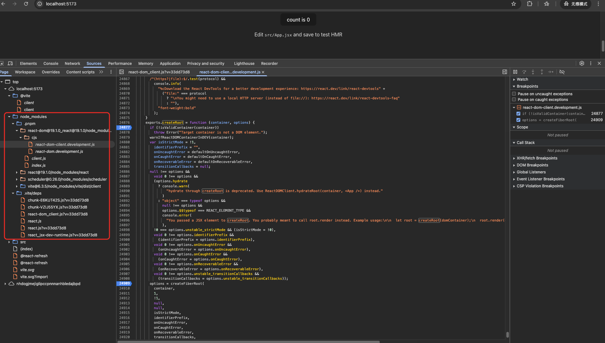
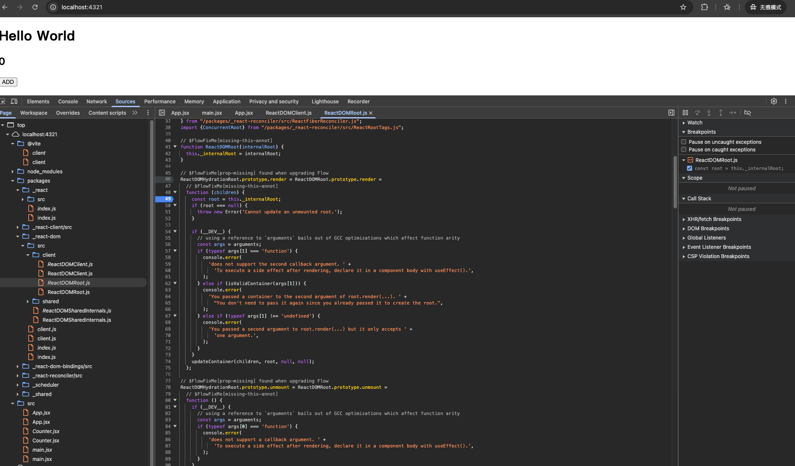

# Vite 搭建 React19.x 源码调试环境

> 目前浏览器已支持 ES 模块，React19.x 后续不再提供 UMDs 文件

相关讨论

- [React remove UMDs](https://github.com/facebook/react/pull/28735)
- [Moving Vite's Node API as ESM only](https://github.com/vitejs/vite/discussions/13928)

## 初始化项目

### 手动搭建

```shell
# 创建项目
mkdir 项目名
cd 项目名

# 初始 pnpm
pnpm init
pnpm add -D vite
```

### 添加脚本

推荐使用 Node 高版本，支持 `{type: module}`

- package.json 中添加以下脚本

```json
{
  "type": "module",
  "scripts": {
    "dev": "vite dev"
    // "build": "vite build"
  }
}
```

### 入口文件

根目录下创建相应文件

- index.html

```html
<!DOCTYPE html>
<html lang="en">
  <head>
    <meta charset="UTF-8" />
    <meta name="viewport" content="width=device-width, initial-scale=1.0" />
    <title>React Vite Debug</title>
  </head>
  <body>
    <div id="root"></div>
    <script type="module" src="/src/main.jsx"></script>
  </body>
</html>
```

- src/main.jsx

```jsx
import * as React from "react";
import { createRoot } from "react-dom/client";
const root = createRoot(document.getElementById("root"));
const App = () => <>Hello World</>;
root.render(<App />);
```

## 运行调试

以上代码如何成功编译并能成功运行，以下为两种调试方法

### 浏览器调试

- 根目录下创建 vite.config.js

```js
import { defineConfig } from "vite";
import react from "@vitejs/plugin-react";
// import react from '@vitejs/plugin-react-swc';

export default defineConfig({
  plugins: [react()],
});
```

- 安装 @vitejs/plugin-react 或 @vitejs/plugin-react-swc
  - pnpm add -D @vitejs/plugin-react
  - pnpm add -D @vitejs/plugin-react-swc
- 直接安装 react 相关的依赖
  - pnpm add react
  - pnpm add react-dom

#### 运行

```shell
pnpm dev
```

利用 vite 编译的 react 代码在浏览器直接进行调试



#### 总结

自行打断点，调试方法可行，但是 `react react-dom` 代码集中在同一个文件里面，对 `react` 的原理、源码分析不友好

### 源码 + 浏览器调试

#### 前提

[React Git 克隆地址](https://github.com/facebook/react)

```shell
# clone v19.1.0 tag 分支代码
git clone --depth=1 https://github.com/facebook/react.git -b v19.1.0
# or ssh support
git clone --depth=1 git@github.com:facebook/react.git -b v19.1.0
```

需要用到以下文件夹

- packages/
  - react
  - react-dom
  - react-dom-bindings
  - react-client
  - react-reconciler
  - scheduler
  - shared

React 采用的是 flow 类型定义，因此需要想办法把 flow type 去除，得到 ESM 文件，可在浏览器支持引入

- 采用 flow-remove-types 对 react 源码进行 flow type 去除类型处理
  - npm i -g flow-remove-types
  - 或直接利用 flow-remove-types 中的 API 自定义 Node 脚本处理

```shell
# 输出目录 输入目录
# --pretty 格式输出（空格替换）
flow-remove-types --pretty --out-dir packages/_react packages/react
flow-remove-types --pretty --out-dir packages/_react-dom packages/react-dom
flow-remove-types --pretty --out-dir packages/_react-dom-bindings packages/react-dom-bindings
flow-remove-types --pretty --out-dir packages/_react-client packages/react-client
flow-remove-types --pretty --out-dir packages/_react-reconciler packages/react-reconciler
flow-remove-types --pretty --out-dir packages/_react-shared packages/react-shared
flow-remove-types --pretty --out-dir packages/_react-scheduler packages/react-scheduler
```

处理完之后，自行复制相应的文件夹到自定义 Vite 配置项目

**注意**

`React` 源码 `build` 构建过程中做了不同环境的支持（server client react-native）

> 含有 forks 的文件夹，React 定义脚本 `yarn build` 中有做不同环境的编译处理，因此需要自行处理下

- packages/react-reconciler/ReactFiberConfig.js

```js
// 使用以下代码进行覆盖
// packages/react-reconciler/src/forks/ReactFiberConfig.dom.js
export * from "react-dom-bindings/src/client/ReactFiberConfigDOM";
export * from "react-client/src/ReactClientConsoleConfigBrowser";
```

#### 配置

- 创建配置文件 vite.config.js
  - flow-remove-types 处理后的文件夹配置本地引用地址
- 安装 @vitejs/plugin-react-swc
  - pnpm add -D @vitejs/plugin-react-swc
  - @vitejs/plugin-react 报错(该插件使用 esbuild 编译，不能用 react 作为 external)

```js
import { defineConfig } from "vite";
import react from "@vitejs/plugin-react-swc";
import path from "path";

const NODE_ENV = process.env.NODE_ENV;
const __DEV__ = NODE_ENV === "development";

export default defineConfig({
  plugins: [react()],
  resolve: {
    // 引用地址指向本地
    alias: [
      // import {} from 'react'
      {
        find: /^react$/,
        replacement: path.resolve(__dirname, "./packages/_react"),
      },
      // import {} from 'react-dom';
      {
        find: /^react-dom$/,
        replacement: path.resolve(__dirname, "./packages/_react-dom"),
      },
      // import {} from 'scheduler';
      {
        find: /^scheduler$/,
        replacement: path.resolve(__dirname, "./packages/_scheduler"),
      },
      // import {} from 'react/?';
      {
        find: /^react\/(.*)$/,
        replacement: path.resolve(__dirname, "./packages/_react/$1"),
      },
      // import {} from 'react-dom/?';
      {
        find: /^react-dom\/(.*)$/,
        replacement: path.resolve(__dirname, "./packages/_react-dom/$1"),
      },
      // import {} from 'shared/?';
      {
        find: /^shared\/(.*)$/,
        replacement: path.resolve(__dirname, "./packages/_shared/$1"),
      },
      // import {} from 'react-dom-bindings/?';
      {
        find: /^react-dom-bindings\/(.*)$/,
        replacement: path.resolve(
          __dirname,
          "./packages/_react-dom-bindings/$1"
        ),
      },
      // import {} from 'react-reconciler/?';
      {
        find: /^react-reconciler\/(.*)$/,
        replacement: path.resolve(__dirname, "./packages/_react-reconciler/$1"),
      },
      // import {} from 'react-client/?';
      {
        find: /^react-client\/(.*)$/,
        replacement: path.resolve(__dirname, "./packages/_react-client/$1"),
      },
    ],
    preserveSymlinks: true,
  },
  optimizeDeps: {
    // 这里是为了 vite 提前编译，运行需要 ReactSharedInternal 变量对象（提前声明）
    include: ["shared/ReactSharedInternals"],
    // react 不需要编译
    // 使用 @vitejs/plugin-react，此处配置不支持，报错
    exclude: ["react"],
  },
  // React 源码当中有很多提前定义的环境变量
  define: {
    __DEV__,
    __EXPERIMENTAL__: true,
    __EXTENSION__: false,
    __PROFILE__: false,
    __TEST__: NODE_ENV === "test",
    __IS_CHROME__: false,
    __IS_FIREFOX__: false,
    __IS_EDGE__: false,
    __IS_NATIVE__: false,
  },
});
```

#### 运行

```shell
pnpm dev
```



#### 总结

- 可直接对 React 仓库源码进行调试，原理分析明确
  - fiber
  - scheduler 优先级调度
  - reconciler 协调
  - dom
  - ...

## 参考

- [遇到运行调试问题，可直接参考使用此项目](https://github.com/LIUeng/react-vite-debug)
- [React19 详细解读](https://github.com/LIUeng/react-parse/tree/main/src/docs19)

## 附

### 使用 VScode 运行检查 React 源码项目

React 使用 flow 语言定义类型

#### 前置

- 禁用内置的 VScode 插件
  - @builtin TypeScript and JavaScript Language Features
- 下载支持 Flow 类型检查插件
  - [Flow Language Support](https://marketplace.visualstudio.com/items/?itemName=flowtype.flow-for-vscode)

#### 运行

Flow 类型检查插件需要在根目录下定义 .flowconfig 配置文件，而 React 源码中提供了 flow 相关的脚本

```json
{
  "scripts": {
    "flow": "node ./scripts/tasks/flow.js",
    "flow-ci": "node ./scripts/tasks/flow-ci.js"
  }
}
```

```shell
yarn install
# yarn flow 命令列表
# yarn flow dom-browser
# yarn flow dom-node
# yarn flow dom-node-webpack
# yarn flow dom-node-turbopack
# yarn flow dom-node-parcel
# yarn flow dom-bun
# yarn flow dom-browser-esm
# yarn flow dom-browser-turbopack
# yarn flow dom-browser-parcel
# yarn flow dom-edge-webpack
# yarn flow dom-edge-turbopack
# yarn flow dom-edge-parcel
# yarn flow dom-node-esm
# yarn flow dom-legacy
# yarn flow markup
# yarn flow dom-fb
# yarn flow native
# yarn flow fabric
# yarn flow test
# yarn flow custom
# 选择一个命令生成 .flowconfig 配置文件
yarn flow dom-browser
```

至此可以使用 VScode Flow 插件进行文件检查，类型定义跳转

## END
